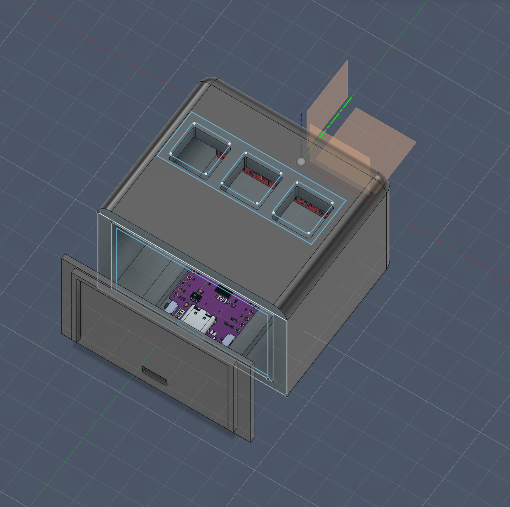
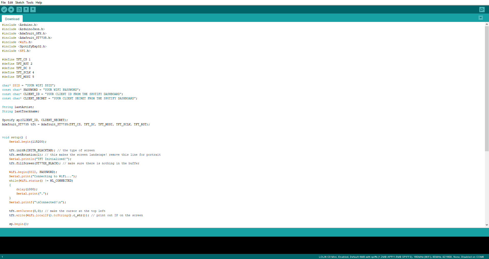

Hello, this is my 3-key Spotify Display with an ESP32. It will use spotify API and WIFI to figure out what songs are being used

The Process
CAD- I used Fusion 360, which I'm more familiar with so the case only took me about 2 hours.

Code- I Used Arduino IDE and the guide, so it only took me about an hour.
